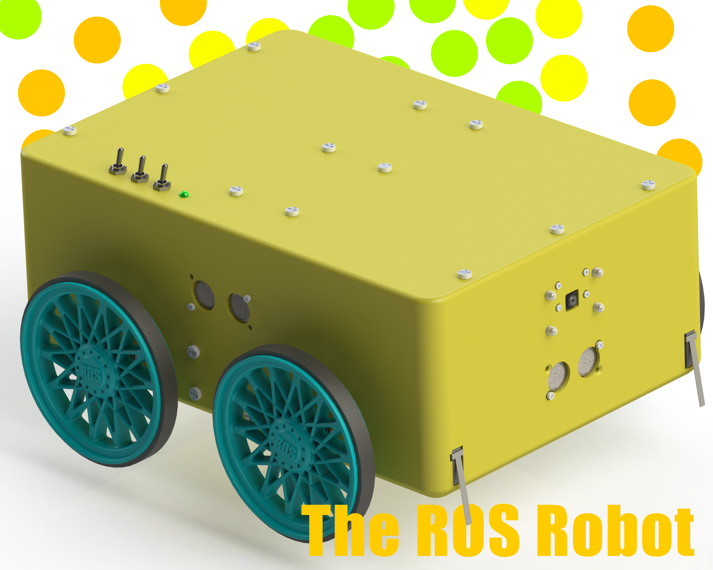

<h1 align="center">The ROS Robot Project</h1>

 

	
	 
	 
	
	|
	
	|
	

 

----
> [!NOTE]
> This project is still under development!

 

This is a 3D render of the CAD designs.

 
 

## Overview
### Future Re-design
This is the first revision of the robot. It features a camera for object detection, and a LiDAR sensor for SLAM.

I will begin deisgn work on the second revision/re-design of this robot as soon as this revision is in a state where it can perform mapping and navigation (SLAM), and basic object detection using the camera.

 

### System Architecture and Mechanical Design Overview
#### System Architecture
The general architecture of the robot's electronics system consists of a main computer *(the Raspberry Pi 5)* and two, less powerful microcontrollers *(the Raspberry Pi Pico/RP2040)*. The Pi 5 handles image processing, mapping & navigation, and any other type of resource-intensive processing whilst the less-powerful Picos handle I/O for motors, sensors, LEDs, etc.

ROS is used to handle communications between multiple nodes either on the same machine (i.e. a mapping node and a navigation node running on the Pi 5) or between external nodes (i.e. the two Raspberry Pi Picos running microROS). Both Raspberry Pi Picos are connected to the Pi 5 via USB cables.

More details regarding the electronics design [here](electronics/).\
 

#### Mechanical Design Overview
The mechanical design of the robot is quite simple. The chassis of the robot is 3D printed in two halves using PLA filament (more details regarding 3D printing [here](cad_files/stl_files/)) and the robot uses four geared DC motors 
(Namiki 22CL-3501PG) in a differential drive configuration.

 

## File Structure
There are 5 folders in this repository.\
Their names and purposes are as follows:

**.github**\
GitHub issue templates, pull request templates, etc.

**assets**\
Assets used on GitHub (such as images used in this README file).

**cad_files**\
3D CAD design files and 3D printing files for the chassis and other mechanical parts of the robot.

**electronics**\
Overall circuit diagrams and PCB design files for the robot.

**source_code**\
Source code for the ROS package of the robot and for the firmware of the Raspberry Pi Picos.

 

## Contact
You can contact me via e-mail.\
E-mail: samyarsadat@gigawhat.net\
If you think that you have found a bug or issue please report it <a href="../../issues">here</a>.

 

## Contributing
Please take a look at <a href="CONTRIBUTING.md">CONTRIBUTING.md</a> for contributing.

 

## Credits
| Role           | Name                                                  |
| -------------- | ----------------------------------------------------- |
| Lead Developer | [Samyar Sadat Akhavi](https://github.com/samyarsadat) |
| CAD Design     | [Samyar Sadat Akhavi](https://github.com/samyarsadat) |
| PCB Design     | [Samyar Sadat Akhavi](https://github.com/samyarsadat) |

 

Copyright © 2022-2025 Samyar Sadat Akhavi.